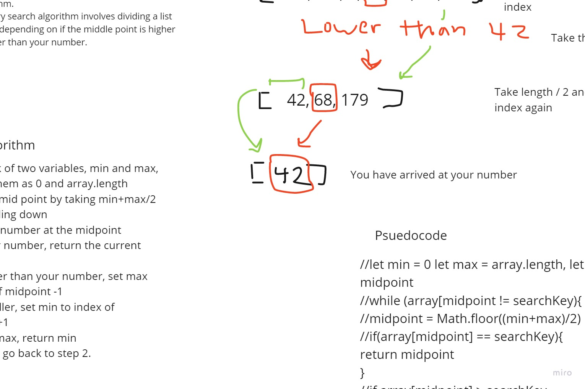

# Binary Search of Sorted Array
Create a function that takes a sorted array and a key and returns the index of that key. 

## Whiteboard Process

## Approach & Efficiency
I think my approach was much better this time. I actually did the whiteboarding on pen and paper because I find it easier than using an app. I solved the problem manually
with several different data sets and developed an algorithm from this. After I had thought about the algorithm some more, I wrote out the algorithm and the pseudo code on paper. 
Finally, I transcribed everything to the whiteboard app.
