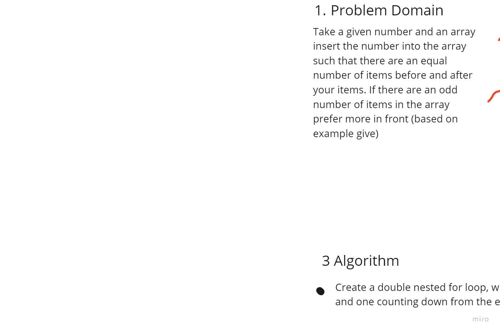

# Insert to Middle of an Array

This challenge requires you to insert a given number into the middle of an array

## Whiteboard Process

## Approach & Efficiency

I think my approach was bad. For one, it uses both .length and .splice, which are array methods, so it isn't the most pure. Secondly, it could fail if there are many duplicate numbers in the array.

If I had more time, I would have tried another approach, but I spent too much time today catching up on prework and messing around with the lab.
